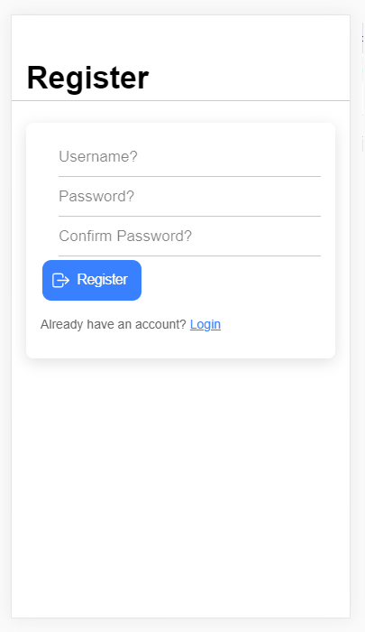
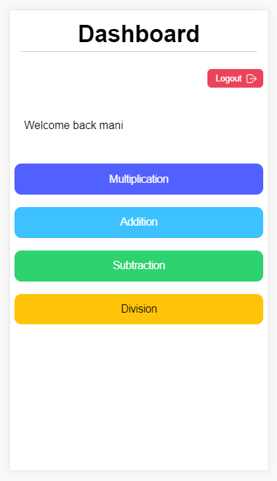

# math-help-home

During the week I get home after my kids and can't be there to make sure they do some kind of homework so I created this simple math generating application to help my kids with multiplication, addition, subtracion and division.

Now I can set them a challenge and once they reach their goal they can send me a screen shot of the results.

See the app live <a href="https://math-help-home.web.app/" target="_blank">math-help-home</a>

- The application has a firebase Authentication login.

</a>
</a>
</a>

- After Registering and Loging in you are taken from the home page to the Dashboard.

- From the Dashboard you will be able to access the different Math challenges.

</a>

- Pressing one of the buttons takes you to that math page.

</a>
</a>
</a>
</a>

- The current date is on the top of the page (to stop cheeky kids sending me the same results).
- The difficulty can be set.
- In the results section are correct and wrong guess counters. The counters are reset if 3 questions are answered wrong.

My kids use iPad's so <a href="https://ionicframework.com/docs/react" target="_blank">Ionic-React</a> was my choice for the front end framework giving the application a native feel.
